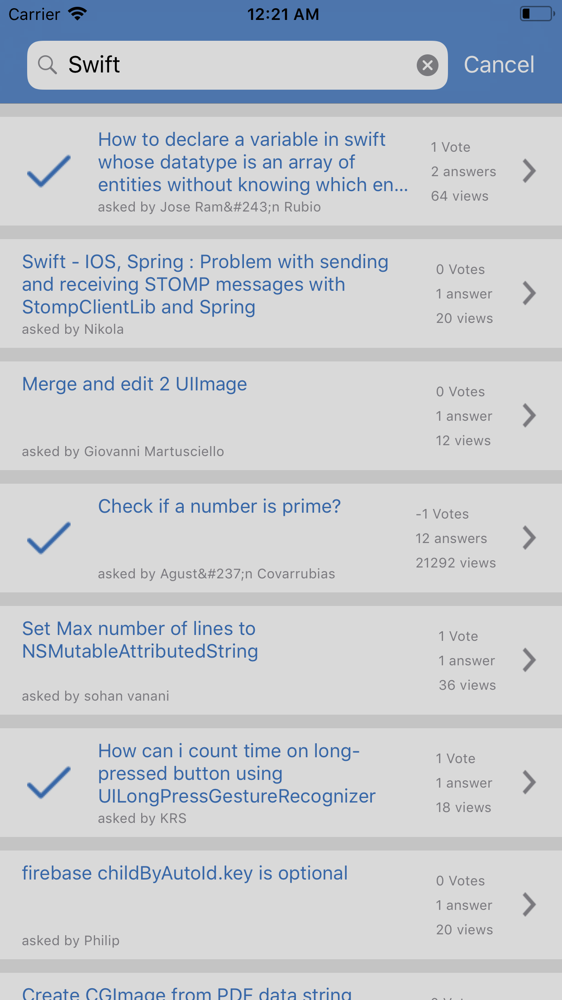
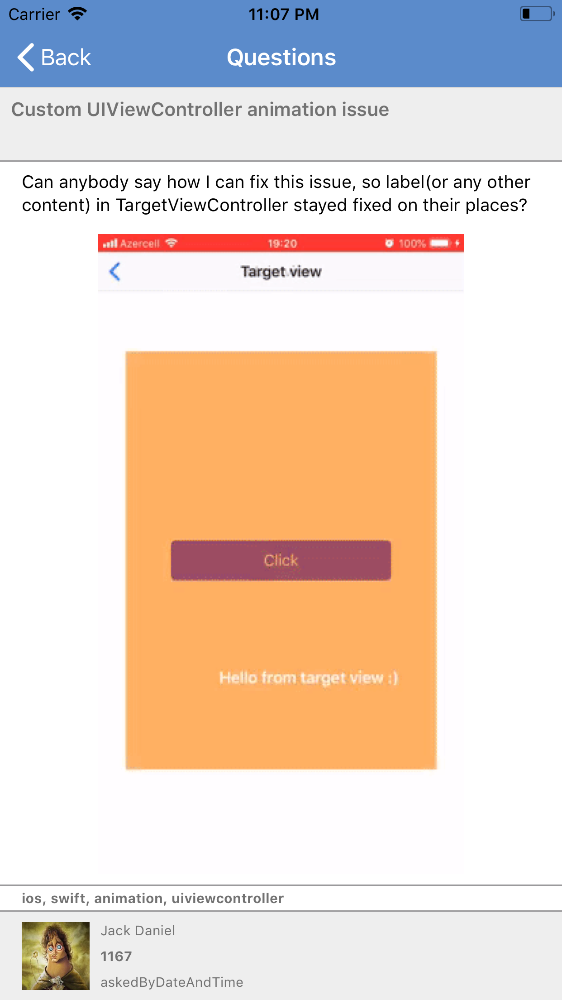
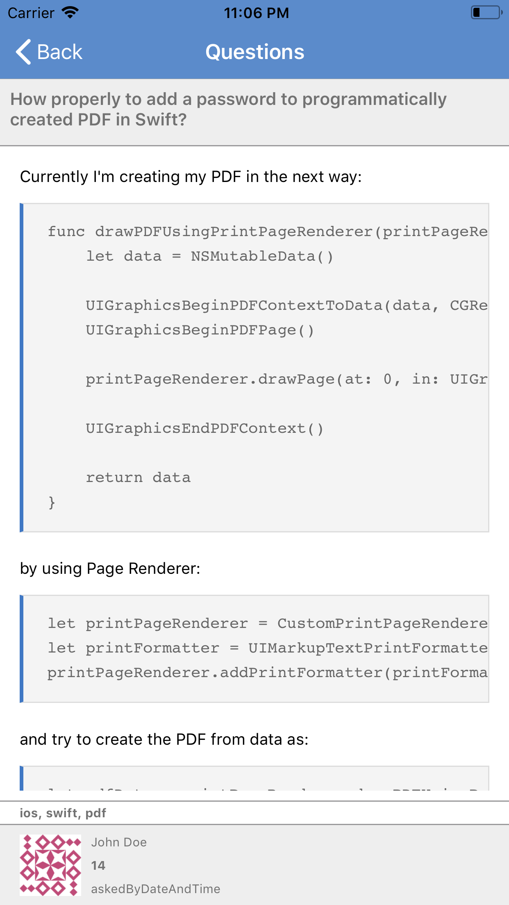

#Global Kinetic Challenge
This is the code sample for the Global Kinetic StackOverFlow search iOS application.

#Features
- Makes use of a UISearchController to accept a search tag to search the Stack Over Flow API.
- The search is limited to 20 posts.
- The search displays a list of posts. A tick is used to represent posts that have already been answered. See 
- The detail view shows everything that the post entails. Including the title of the post, the post itself, the person who asked the question and when the question was asked.
- The post body shows the post, associated images where necessary and also styled code snippets added to each question See  and See 

#Unit Tests
- This project includes unit tests teh SearchViewModel

#To Do Still
- Unit tests for the repository
- Loading pulse to be shown when a service call is being made
- Show an error message to the user when an error occurs
- A placeholder image for when we are unable to get an image for a posters profile image